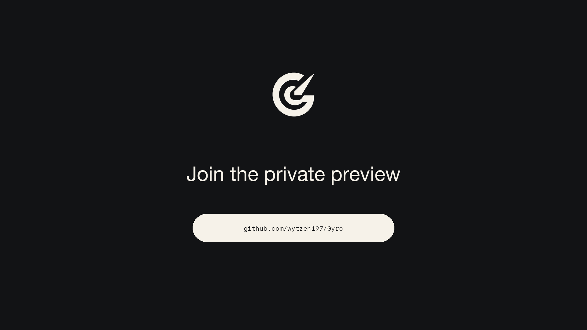
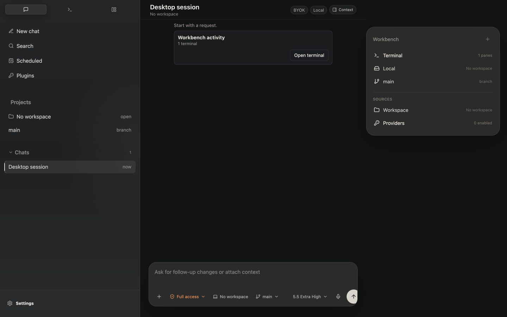
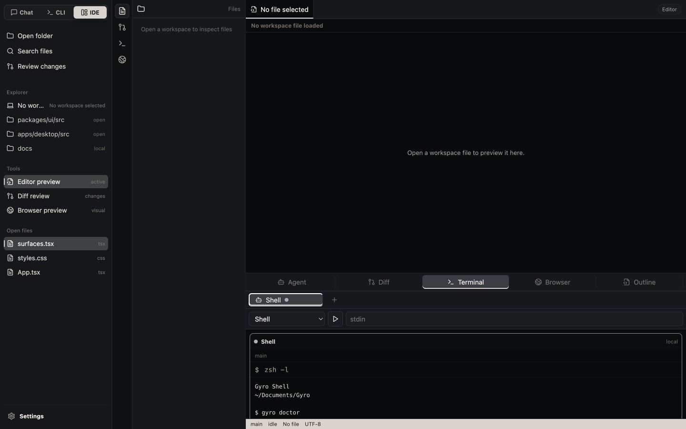
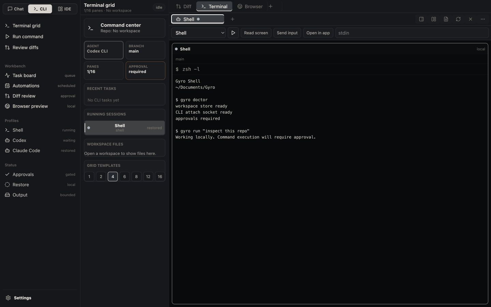
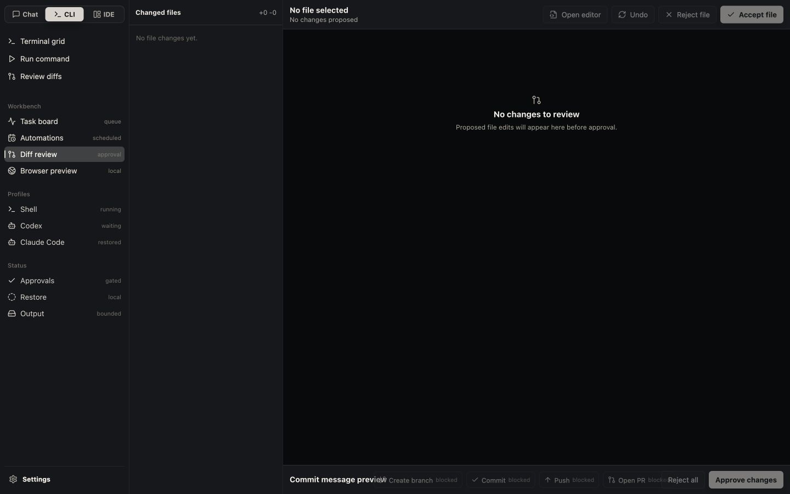

# Gyro

**A local-first agent workbench for coding with control.**

Gyro brings agent chat, terminals, files, diffs, approvals, tasks, and provider
state into one macOS workspace. Start in the app or the `gyro` CLI, then resume
the same local session from either surface.

[](LICENSE)
[](https://github.com/wytzeh197/Gyro/actions/workflows/ci.yml)
[](https://github.com/wytzeh197/Gyro)

[Download the latest Alpha](https://usegyro.io/) ·
[GitHub Releases](https://github.com/wytzeh197/Gyro/releases/latest) ·
[Watch the launch film](docs/media/launch/gyro-launch-film.mp4) ·
[Read the architecture](docs/architecture.md) ·
[Contribute](CONTRIBUTING.md)

[](docs/media/launch/gyro-launch-film.mp4)

> [!IMPORTANT]
> Gyro is currently a public alpha for macOS and is not recommended for
> production use. Alpha downloads are not signed with an Apple Developer ID or
> notarized, so macOS requires a one-time **Open Anyway** confirmation. Follow
> the [macOS installation guide](docs/install-macos.md); do not disable
> Gatekeeper or remove quarantine globally. Only install Gyro if you are
> comfortable testing software that can read files and run commands.

## Why Gyro

- **Two surfaces, one execution engine.** Sessions unifies Chat and subscription
  CLI work; Workspace keeps files, diffs, Git, tests, and diagnostics in view.
- **Local by default.** Session history, configuration, and worktrees stay on
  your Mac. Gyro does not send telemetry by default.
- **Visible control.** Commands and file changes follow an explicit approval
  policy, with diffs and run state kept in view.
- **Bring your own agent.** Codex CLI and Claude Code are the first executable
  adapters. Other providers remain clearly marked until their adapters exist.
- **Safe parallel work.** Create isolated Git worktrees for risky or concurrent
  runs without changing the default local workflow.

## Product Tour

<p align="center">
  
  
</p>
<p align="center">
  
  
</p>

## What Works Today

- Provider-backed conversations through local Codex CLI and Claude Code.
- Shared local sessions across Gyro.app and the `gyro` CLI.
- PTY terminals with profiles, restore, input, resize, stop, and restart.
- Workspace browsing, Monaco editing, guarded saves, search, Git status, tasks,
  tests, output, diagnostics, diffs, and browser preview.
- Provider setup checks, approval policies, redacted diagnostics, local
  worktrees, and persisted automations.
- Gated Codex and supported Claude CLI and desktop Chat text changes applied by a shared
  workspace-bound transaction with fresh-hash checks, multi-file rollback, and
  durable approval events. A pre-commit journal in Gyro Application Support lets
  CLI and desktop startup finish recorded changes or roll interrupted changes
  back without adding metadata to the repository.

## Install the Public Alpha

Gyro.app requires macOS 14 or newer. Use the
[download site](https://usegyro.io/) to choose the Apple Silicon
build for M-series Macs or the Intel build for Intel Macs. GitHub
[Releases](https://github.com/wytzeh197/Gyro/releases/latest) remains the
artifact source and fallback.

The download is an explicitly unsigned Alpha: its app bundle is ad-hoc signed
for structural integrity, but it has no Apple Developer ID signature or Apple
notarization. Read [Install Gyro on macOS](docs/install-macos.md) for the safe
one-time **System Settings → Privacy & Security → Open Anyway** flow,
checksum verification, uninstall, and rollback instructions.

Homebrew installs only the `gyro` CLI, not Gyro.app:

```bash
brew tap wytzeh197/tap
brew trust --formula wytzeh197/tap/gyro
brew install gyro
```

See [Homebrew packaging](docs/homebrew.md) for verification and upgrade
commands.

## Build From Source

### Requirements

- macOS 14 or newer
- Node.js 22 or newer
- pnpm 11 or newer (the workspace pins pnpm 11.7.0)
- Rust 1.78 or newer
- Xcode command line tools

### Run the desktop app

Run all commands from the repository root:

```bash
git clone https://github.com/wytzeh197/Gyro.git
cd Gyro
corepack enable
pnpm install --frozen-lockfile
pnpm doctor
pnpm check
cargo test --workspace
pnpm desktop:dev
```

To build and install a local app bundle for Finder or Dock testing:

```bash
pnpm desktop:install-local
```

This installs `Gyro.app` in `~/Applications`. Do not open or pin
`target/debug/gyro-desktop`; it is a raw development executable and expects the
Vite server to be running.

### Try the CLI

```bash
cargo run -p gyro-cli -- doctor
cargo run -p gyro-cli -- setup
cargo run -p gyro-cli -- run "Inspect this repository"
cargo run -p gyro-cli -- sessions
cargo run -p gyro-cli -- resume
cargo run -p gyro-cli -- approvals
```

`gyro doctor` labels checks as required or optional and prints the next recovery
action when one is available. `gyro setup` combines that guidance with live app,
profile, agent, and provider readiness checks.

Use `--worktree` with `gyro run` or `gyro app attach` when you explicitly want
an isolated Git worktree. Local mode is the default.

Automation-facing commands emit the versioned `gyro.cli.v1` JSON contract with
`--json`. Interactive chat uses newline-delimited events so input can be piped
without prompts contaminating stdout:

```bash
cargo run -p gyro-cli -- sessions --json
printf 'Inspect this repository\n/exit\n' | \
  cargo run -p gyro-cli -- chat --profile codex --approve --json
cargo run -p gyro-cli -- app open --json
```

Interactive Codex and Claude runs ask about each provider command or file action
that reaches the active approval policy. Desktop Claude Chat sends those
permission callbacks to Gyro.app over a versioned, user-only local socket.
Non-interactive commands fail closed unless `--approve` explicitly auto-accepts
those callbacks. Reviewed Codex file sets and Claude Write/Edit/MultiEdit
actions are applied once through Gyro's shared atomic transaction before the
provider's native write is suppressed;
an Application Support journal makes final rename recovery restart-safe, while
unsupported notebook or binary edits fail closed. Durable Gyro file proposals
can be reviewed and decided from any terminal without exposing their content in
the inbox:

Codex and Claude provider session IDs are recorded as soon as the provider
accepts them. A crashed or interrupted run remains resumable; if the provider
reports that a stored session is stale, Gyro clears that cursor and requires an
explicit retry in a fresh provider session so tools cannot be replayed
automatically. Explicit profiles honor the shared provider toggle, so enable a
disabled provider with `gyro config enable-provider <id>` before launching it.
Structured authentication failures report the provider login command and
preserve the Gyro session for a later `gyro resume`.

```bash
gyro approvals
gyro approvals show <proposal-id>
gyro approvals approve <proposal-id>
gyro approvals reject <proposal-id>
```

Add `--json` to use the versioned `gyro.cli.v1` contract. Approval applies are
content-hash guarded and fail if the file changed after it was proposed.

CLI-to-app handoff uses a versioned local acknowledgement. Incompatible
pre-1.0 minor versions fail closed and report both installed versions with a
same-release-channel recovery instruction. Stale app sockets are detected with
a live probe and removed before launch or resumable fallback; legacy app
acknowledgements remain accepted during the transition.

Generate shell completions directly from the installed binary:

```bash
gyro completions zsh > "${fpath[1]}/_gyro"
gyro completions bash > ~/.local/share/bash-completion/completions/gyro
gyro completions fish > ~/.config/fish/completions/gyro.fish
```

Tagged releases include separate Apple Silicon and Intel CLI archives, a
matching `.sha256` sidecar for each archive, and an aggregate `SHA256SUMS` file.
The release also includes a generated `gyro.rb` Formula with immutable URLs and
the real checksums; the checked-in Formula is only the release template.

## How It Fits Together

```text
crates/gyro-core       Local engine, storage, policy, redaction, worktrees, IPC
crates/gyro-cli        Terminal interface and app handoff
apps/desktop           Tauri + React macOS application
packages/ui            Shared React surfaces and components
docs                   Architecture, privacy, release, and product notes
packaging/homebrew     Release-time CLI Formula template
```

Session metadata is stored in SQLite and events in append-only JSONL under:

```text
~/Library/Application Support/Gyro/
```

See [Architecture](docs/architecture.md) for the engine and data-flow model and
[Privacy](docs/privacy.md) for the local-data defaults.

## Project

Gyro is licensed under [Apache-2.0](LICENSE). Contributions use
[Developer Certificate of Origin](CONTRIBUTING.md#developer-certificate-of-origin)
signoff instead of a CLA.

- [Contributing guide](CONTRIBUTING.md)
- [Security policy](SECURITY.md)
- [Support](SUPPORT.md)
- [Code of Conduct](CODE_OF_CONDUCT.md)
- [Governance](GOVERNANCE.md)
- [Release process](docs/release.md)
