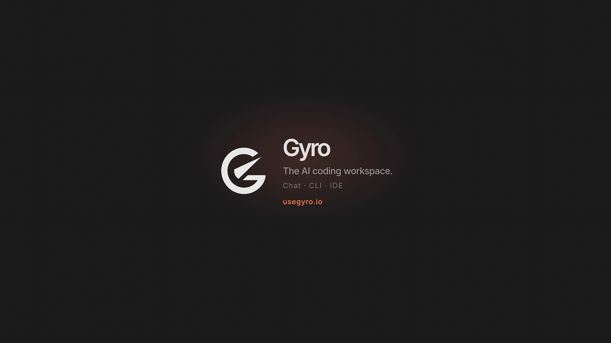
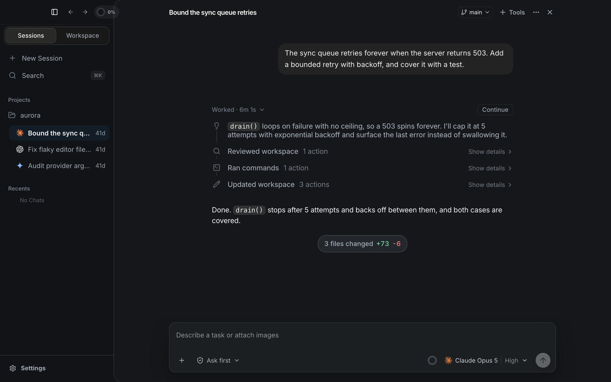

# Gyro

**Chat, CLI, and IDE in one place.**

Gyro is a local-first macOS workspace for agent chat, subscription CLIs, files,
diffs, terminals, and tasks. Start in Chat, move into the CLI or Workspace, and
keep the same session with you.

[](LICENSE)
[](https://github.com/wytzeh197/Gyro/actions/workflows/ci.yml)
[](https://github.com/wytzeh197/Gyro)

[Download](https://usegyro.io/) ·
[Releases](https://github.com/wytzeh197/Gyro/releases/latest) ·
[Architecture](docs/architecture.md) ·
[Contribute](CONTRIBUTING.md)

[](docs/media/launch/gyro-launch-film.mp4)

> [!IMPORTANT]
> Public alpha for macOS. Not recommended for production. Downloads are not
> Apple Developer ID signed or notarized, so macOS requires a one-time
> **Open Anyway** confirmation. Follow the
> [macOS installation guide](docs/install-macos.md). Do not disable Gatekeeper
> or remove quarantine globally.

<p align="center">
  
</p>

## Install

macOS 14 or newer. Apple Silicon and Intel builds are on
[usegyro.io](https://usegyro.io/) and
[GitHub Releases](https://github.com/wytzeh197/Gyro/releases/latest).

Homebrew installs the `gyro` CLI only, not Gyro.app:

```bash
brew tap wytzeh197/tap
brew install wytzeh197/tap/gyro
```

## Build from source

Requires macOS 14+, Node.js 22+, pnpm 11+, Rust 1.78+, and Xcode CLT.

```bash
git clone https://github.com/wytzeh197/Gyro.git
cd Gyro
corepack enable
pnpm install --frozen-lockfile
pnpm doctor
pnpm desktop:dev
```

```bash
pnpm desktop:install-local   # Gyro.app → ~/Applications
cargo run -p gyro-cli -- doctor
```

Do not open `target/debug/gyro-desktop`; it expects the Vite server.

## Docs

- [Architecture](docs/architecture.md) · [Privacy](docs/privacy.md) · [Roadmap](docs/roadmap.md)
- [Install on macOS](docs/install-macos.md) · [Homebrew](docs/homebrew.md) · [Local models](docs/local-models.md)
- [Contributing](CONTRIBUTING.md) · [Security](SECURITY.md) · [Support](SUPPORT.md)

Apache-2.0. Contributions use [DCO](CONTRIBUTING.md#developer-certificate-of-origin) signoff.
