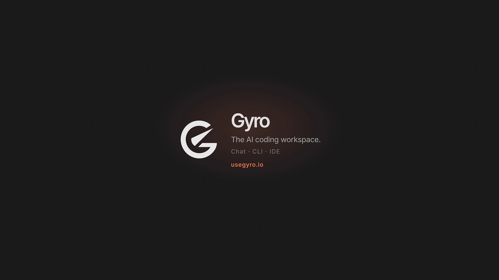
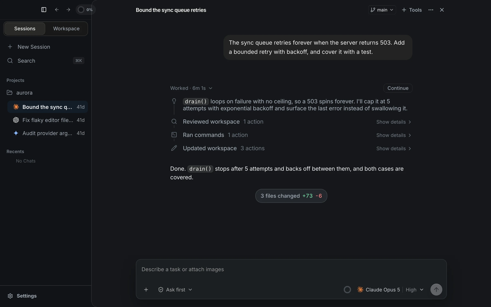

# Gyro

**Chat, CLI, and IDE in one place.**

Gyro is a local-first macOS workspace for agent chat, subscription CLIs, API
providers, and local models, alongside your files, diffs, terminals, and
scheduled work. Start in Chat, move into the CLI or Workspace, and keep the same
session with you.

[](LICENSE)
[](https://github.com/wytzeh197/Gyro/actions/workflows/ci.yml)
[](https://github.com/wytzeh197/Gyro)

[Download](https://usegyro.io/) ·
[Releases](https://github.com/wytzeh197/Gyro/releases/latest) ·
[Changelog](https://usegyro.io/changelog/) ·
[Architecture](docs/architecture.md) ·
[Contribute](CONTRIBUTING.md)

[](docs/media/launch/gyro-launch-film.mp4)

> [!IMPORTANT]
> Public alpha for macOS. Not recommended for production. Alpha app bundles use
> an ad-hoc signature and are not Apple-signed or notarized, so macOS requires a
> one-time **Open Anyway** confirmation. Follow the
> [macOS installation guide](docs/install-macos.md). Do not disable Gatekeeper
> or remove quarantine globally.

<p align="center">
  
</p>

## What Gyro does

- **One session across surfaces.** The app and the `gyro` CLI share one local
  session store, so a conversation can start in either place and resume in the
  other with its run state, approvals, and history.
- **Bring your own agent.** Use the agent subscriptions you already have, a
  local model, or an API key, without keeping a separate workspace per provider.
- **Approvals before mutation.** Commands, file edits, and sensitive reads stay
  visible before they change local state. Choose **Ask for approval**,
  **Approve for me**, or **Full access**; Plan mode stays non-mutating.
- **Goals and plans on the composer.** Pin the outcome a session is pursuing,
  and approve a finished plan with **Implement** or **Keep planning** before
  any edit starts.
- **A real workbench.** Files, Git, diffs, problems, output, test results, a
  terminal grid, a browser, and interactive Canvas previews sit in the same
  window as the chat. A session can span several project folders, and chats
  can run side by side in a split layout.
- **A browser the agent can use.** Models open, read, and inspect pages in a
  per-session browser. It stays in the background while you work in split
  chats, and opens beside the chat when you want to watch or take over.
- **Scheduled work.** Automations run agent tasks on a schedule with pause, stop
  conditions, receipts, and recovery across restarts.
- **Delegated research.** A read-only sub-agent investigates a question in its
  own child session and returns only its final report to the chat.
- **Usage you can see.** Turn tokens, plan-usage meters, and provider retries
  are reported per session; estimates are not hard spend ceilings.
- **Local-first trust.** Sessions, config, worktrees, and usage stay on your
  Mac; provider keys live in the macOS Keychain; logs are redacted; app
  telemetry is off by default.

## Providers

- **Subscription CLIs.** Claude Code, Codex, Gemini CLI, Kimi Code, and Grok run
  through their own local CLIs. Cursor and OpenCode are experimental.
- **Local models.** Ollama runs on your Mac, with discovered models and governed
  Gyro tools where the model supports them. See [Local models](docs/local-models.md).
- **API keys.** DeepSeek, Mistral, and OpenRouter ship as presets, and any
  OpenAI-compatible endpoint can be added as a custom provider, including local
  servers on loopback. Keys are stored in the Keychain and sent only to the
  endpoint you configured. See [API-key providers](docs/api-key-providers.md).

New models arrive through a validated remote catalog, so most model launches
need no app update. See [Model catalog](docs/model-catalog.md).

## Install

macOS 14 or newer. Apple Silicon and Intel builds are on
[usegyro.io](https://usegyro.io/) and
[GitHub Releases](https://github.com/wytzeh197/Gyro/releases/latest).

Homebrew installs the `gyro` CLI only, not Gyro.app:

```bash
brew tap wytzeh197/tap
brew install wytzeh197/tap/gyro
```

Keep the app and CLI on the same version for session handoff.

## Status

Gyro is working toward **v0.1.0**, its first non-alpha release. Before it
ships, the macOS app will move from ad-hoc signing to Developer ID signing
with Apple notarization, and the clean-machine path—install, connect a
provider, first reply, approved edit, restart and resume—must pass on fresh
Apple Silicon and Intel Macs. Progress and scope are tracked in the
[roadmap](docs/roadmap.md); every alpha is listed in the
[changelog](https://usegyro.io/changelog/).

Known limits in the current alpha:

- App bundles are ad-hoc signed; first launch needs **Open Anyway**.
- Cursor and OpenCode are experimental and not approval-safe adapters.
- Notebook and binary file edits are refused rather than applied.
- Keep the app and CLI on the same version when handing sessions between them.

## Build from source

Requires macOS 14+, Node.js 22+, pnpm 11+, Rust 1.78+, and Xcode CLT.

```bash
git clone https://github.com/wytzeh197/Gyro.git
cd Gyro
corepack enable
pnpm install --frozen-lockfile
pnpm doctor
pnpm desktop:dev
```

```bash
pnpm desktop:install-local   # Gyro.app → ~/Applications
cargo run -p gyro-cli -- doctor
```

Changes are checked with `pnpm check`, `pnpm test`, and `cargo test --workspace`.
Do not open `target/debug/gyro-desktop`; it expects the Vite server.

## Docs

- [Architecture](docs/architecture.md) · [Verification](docs/verification.md) · [Privacy](docs/privacy.md) · [Roadmap](docs/roadmap.md)
- [Install on macOS](docs/install-macos.md) · [Homebrew](docs/homebrew.md) · [Local models](docs/local-models.md) · [API-key providers](docs/api-key-providers.md)
- [Permissions](docs/permissions.md) · [Contributing](CONTRIBUTING.md) · [Security](SECURITY.md) · [Support](SUPPORT.md)

Apache-2.0. Contributions use [DCO](CONTRIBUTING.md#developer-certificate-of-origin) signoff.
