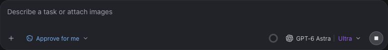

# Maximum-effort label — 2 October 2026

The shared composer colors only its effort label purple when the selected
effort is the model's highest supported option. This follows the existing
slider order and maximum detection, rather than checking only the word Ultra,
and applies without chat-mode or composer-variant conditions.

`--gyro-effort-max` is fixed purple (#a45cff dark, #7c3bc7 light), independent
of the user accent. The model name, chip background, provider mark, chevron,
and divider retain their existing styling. Lower efforts keep the muted text.
The effort popup's existing presentation is unchanged.

UI typecheck, workbench smoke, UI token checks, and diff whitespace checks passed.
Browser checks used the existing production-component fixtures: Ultra in the
running chat, Max in the welcome composer in both themes, and Low reverting
to muted text. These checks establish rendering, not live-provider behavior.

