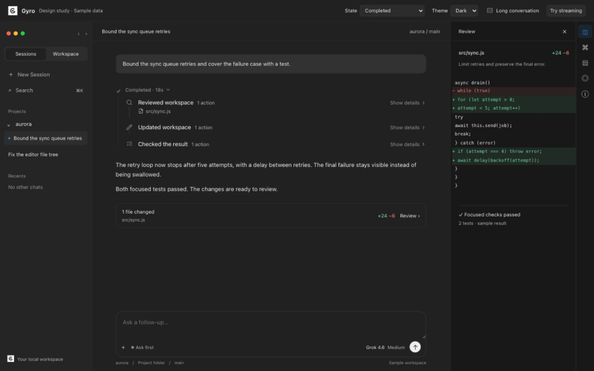

# Gyro execution evidence and visual prototype — 11 September 2026

This milestone implements opt-in local timing, a reproducible native provider benchmark, and an isolated interactive design study. The main result is that measured process creation is small, while the provider turn loop dominates elapsed time. Reliability findings prevent treating an edit on disk or a provider's “done” event as sufficient proof of a completed task.

The updated-main matrix contains **90/90 slots**: **46 provider calls finished, 42 produced correct outputs with a response, 14 failed, and 30 Claude slots were unavailable**. Of the failures, 10 nevertheless left independently correct files. 4 finished calls left incorrect or unapplied output; 4 had pending Workspace edit proposals. The requested runtime optimization decisions remain evidence-led; this patch does not introduce pooling or replace a provider runtime.

- **xai:** 23/30 correct completed trials; 7 failed. Recorded tools per finished turn: median 19, maximum 30.
- **openai:** 19/30 correct completed trials; 7 failed. Recorded tools per finished turn: median 11, maximum 20.

## Checkout and method

The checkout was fast-forwarded to main commit `dff35c2b3bec4b0a02d0094d6af2610b0623b27c` and switched to `codex/alpha-47.6`, preserving the existing working changes. The base package version is still `0.1.0-alpha.47.5`; no version bump, commit, push, or release was made. The earlier alpha 47.4 partial dataset is [archived separately](baseline-alpha-47.4/README.md) and is not included in these totals or used as a controlled before/after comparison.

The benchmark ran the checkout's debug executable through the real desktop `run_provider_chat`, provider adapters, capability bridge, persistence, and cancellation manager. The isolated socket was verified against its owning process and exact executable. See [environment and binary hash](environment.json), [runtime identity](runtime-identity.json), and [reproduction instructions](../README.md). The executable remained frozen throughout this matrix; later changes only refined diagnostics, source organization, and benchmark validation. They did not change execution/retry policy.

Five fresh and five resumed trials were scheduled per task/provider. Grok `grok-4.6`, Codex `gpt-5.6-sol`, and Claude `claude-sonnet-5` requested medium effort. These are nominal settings across different runtimes, not identical reasoning budgets. Providers had separate concurrent workers; trials within a provider were sequential. Claude's first request returned an authentication failure, so the remaining 29 Claude slots were recorded as unavailable without repeating the failing sign-in call. No Claude speed or reliability pass is inferred.

Each trial used a new disposable `meridian-v1` Git repository, with the same instructions and starting content: a 267-line README, a small JavaScript clamp function with an upper-bound bug, one lower-bound test, and a linked guide. The tasks were:

1. Shorten README to at most 85 lines while preserving its identity, installation, usage, test command, and guide link.
2. Fix the clamp upper bound and add exactly one focused upper-bound test. An independent five-case oracle and `node --test` checked the output.
3. Append one mascot line. Resumed sessions first read the fixture and remembered “heron” without editing; their measured turn had to recall it. Fresh sessions received that context directly.

Resume bootstrap latency is excluded. Of finished resumed turns, **20/20** reported an actual resume and **20/20** preserved the bootstrap provider cursor. The durable provider response supplies this metadata because the generic status envelope contains default resume/retry fields. **60 measured turns** have a clean, non-conflicted Git preparation snapshot; unavailable slots do not pretend to have workspace timing.

A 150-second per-turn watchdog invoked the real cancellation path. Native command/file approval flags were off in the disposable store, local terminal execution was allowed, and browser/GitHub access was denied. Explicit `Workspace.propose_edit` remains a separate review flow under those settings: the harness never silently approved proposals. The normal user store, integrations, sign-ins, and socket were not changed. The isolated usage guard remained enabled with a finite 200-call allowance.

**Checker correction:** the original fresh mascot prompt included a period immediately after `heron`, while its initial checker expected no period. The summarizer independently rechecked saved files against `git show HEAD:README.md`, accepting either punctuation interpretation only when the entire change was an exact one-line append with no other modified or untracked files. This corrected 9 initially false results. Each record preserves `correctAsInitiallyRecorded` and the recheck method. No provider call was rerun to obtain a better score. Resumed and fresh outputs use the same corrected check. The native checker and focused regression tests now enforce that rule.

## Trial results

“Finished” means the provider command returned normally; it does not mean the requested edit was applied. Correctness and response presence are separate checks. Correct-only timing avoids making quick unapplied proposals look like successful edits. Failed/cutoff calls remain in failure counts and are excluded from finished-call latency medians. With five observations per cell, these are descriptive samples, not confidence bounds or provider rankings.

| Provider | Task | Session | Finished / slots | Correct + response | Correct median / slowest (s) | All finished median / slowest (s) | Failed | Unavailable | Retries |
|---|---|---|---:|---:|---:|---:|---:|---:|---:|
| xai | readme | fresh | 5/5 | 5 | 60.54 / 64.31 | 60.54 / 64.31 | 0 | 0 | 0 |
| xai | readme | resumed | 5/5 | 5 | 65.06 / 87.03 | 65.06 / 87.03 | 0 | 0 | 0 |
| xai | code | fresh | 5/5 | 5 | 58.30 / 112.12 | 58.30 / 112.12 | 0 | 0 | 0 |
| xai | code | resumed | 2/5 | 2 | 92.77 / 106.97 | 92.77 / 106.97 | 3 | 0 | 0 |
| xai | follow-up | fresh | 3/5 | 3 | 126.70 / 129.38 | 126.70 / 129.38 | 2 | 0 | 0 |
| xai | follow-up | resumed | 3/5 | 3 | 118.60 / 126.58 | 118.60 / 126.58 | 2 | 0 | 0 |
| openai | readme | fresh | 5/5 | 5 | 64.68 / 75.73 | 64.68 / 75.73 | 0 | 0 | 0 |
| openai | readme | resumed | 5/5 | 3 | 81.60 / 88.57 | 56.71 / 88.57 | 0 | 0 | 0 |
| openai | code | fresh | 3/5 | 3 | 43.68 / 136.23 | 43.68 / 136.23 | 2 | 0 | 0 |
| openai | code | resumed | 1/5 | 0 | — / — | 74.48 / 74.48 | 4 | 0 | 0 |
| openai | follow-up | fresh | 5/5 | 5 | 93.84 / 98.79 | 93.84 / 98.79 | 0 | 0 | 0 |
| openai | follow-up | resumed | 4/5 | 3 | 77.61 / 86.23 | 58.55 / 86.23 | 1 | 0 | 0 |
| anthropic | readme | fresh | 0/5 | 0 | — / — | — / — | 0 | 5 | 0 |
| anthropic | readme | resumed | 0/5 | 0 | — / — | — / — | 0 | 5 | 0 |
| anthropic | code | fresh | 0/5 | 0 | — / — | — / — | 0 | 5 | 0 |
| anthropic | code | resumed | 0/5 | 0 | — / — | — / — | 0 | 5 | 0 |
| anthropic | follow-up | fresh | 0/5 | 0 | — / — | — / — | 0 | 5 | 0 |
| anthropic | follow-up | resumed | 0/5 | 0 | — / — | — / — | 0 | 5 | 0 |

All reported retry counts above come from real trial metadata/traces. The separate forced-disconnect probe below intentionally caused retries. Machine-readable rows, outcomes, resume checks, pending-proposal counts, and timing sample sizes are in [measurements.json](measurements.json); the simpler [results table](results-table.md) is also generated by the summarizer.

## Where elapsed time goes

The following measurements include finished provider calls, including unapplied proposals, and exclude bootstrap turns and cutoffs. All values are milliseconds. Stage sample sizes and raw, content-free points are in [the summary](measurements.json) and [backend traces](backend-traces.json). Stages overlap: tool time is inside the provider phase and must not be added to it.

| Measured stage | Grok median / slowest | Codex median / slowest |
|---|---:|---:|
| Workspace preparation (ms) | 16.25 / 56.47 | 15.69 / 109.00 |
| Process creation (ms) | 4.04 / 6.51 | 4.45 / 9.87 |
| Spawn → protocol ready (ms) | 325.34 / 1463.12 | 265.41 / 2287.12 |
| Backend received → first activity (ms) | 4204.49 / 19627.53 | 6652.88 / 10705.10 |
| Prompt sent → provider complete (ms) | 69266.31 / 128983.46 | 65513.05 / 135731.12 |
| Finalization (ms) | 31.41 / 110.59 | 29.13 / 94.88 |
| Union of closed tool spans (ms) | 599.92 / 1693.25 | 546.40 / 3272.87 |

The evidence ranks the next investigations as follows:

1. **Provider turn loop:** prompt-to-completion dominates backend wall time. This interval includes model waiting, network transit, orchestration, tool round trips, and potentially background commands. It is not a measurement of pure inference. Profile the sequence and completion contract for small tasks before choosing an architectural optimization.
2. **Agent/tool work:** the small fixtures still trigger many discovery, read, check, and verification calls. Transcript inspection found repeated workspace checks and test runs for one-line documentation appends. The timing data identifies an opportunity to reduce unnecessary rounds, but does not establish that every call was unnecessary or quantify the speedup from removing one. Test a simpler provider-specific tool/instruction contract with identical fixtures and approval semantics.
3. **Gyro startup overhead:** workspace preparation and process creation are small in this dataset; protocol readiness is larger but still much smaller than the full turn. Fresh process startup is real, but these observations do not justify pooling as the first change. Keep it outside this milestone.
4. **Rendering:** production Send-to-paint is instrumented but **unmeasured by this native harness**. It cannot be ranked against provider latency from this dataset. The separate prototype measurements below establish only the study's interaction behavior.

Tool spans come from protocol boundaries; intervals are merged to avoid double-counting overlap. An open tool is not treated as finished. Background terminal work can outlive a protocol call, so short recorded tool durations do not prove all execution was cheap. The exported [capability timing file](capability-timings.json) is empty when direct protocol traces are sufficient; missing hooks are never interpreted as zero work.

## Reliability findings

**Retry after an edit can duplicate the mutation.** The focused probe invokes the real retry function with a deterministic runner that appends to a real temporary file and then simulates a disconnect. Disconnect-before-edit produced two attempts and one mutation; disconnect-after-edit produced two attempts and two mutations; repeated disconnect-after-edit produced three attempts and three mutations. A newly observed resume cursor was not reused for the retry. [Machine-readable fault evidence](fault-evidence.json) records those counts. The test is a characterization of current behavior, not a safety pass and not a live network fault against every provider. This behavior remains unfixed in this evidence milestone.

**Cancellation state differs by provider.** On updated main, Codex watchdog stops persisted `cancelled` with `stopped` recovery. Grok returned `xAI ACP run cancelled` but persisted `failed` with `retry` recovery. The existing cancellation classifier does not recognize that wording. The report classifies these benchmark cutoffs as failures rather than successful completions. Deadline-to-return overhead had a median of 287.2 ms and maximum 352.1 ms; this includes watchdog scheduling and cleanup, not just Stop handling.

**Files and completion can disagree.** 10 cutoff calls left correct output on disk, but lacked a successful provider result. Conversely, 4 normally finished calls had an unapplied Workspace proposal and failed the requested output check. Observed Codex responses sometimes accurately said the proposal was pending; the issue is that provider-command completion, approval state, applied output, and task completion need distinct representation. Do not infer that those responses falsely claimed an applied edit.

Existing focused suites also exercise stale resume-cursor handling, provider process-group cancellation, ACP cancellation, persisted resume through a stub-binary crash, startup reconciliation of interrupted turns, and streamed answers followed by a nonzero process exit. Those checks passed at their tested layers. They do not replace live disconnect/restart trials for an unavailable Claude integration.

The first runtime follow-up should therefore address mutation-safe retry and authoritative stop/approval/completion states, then measure simpler tool rounds. Provider pooling and broad runtime replacement remain unjustified by this first sample.

## Interactive design study

Open [the local prototype](http://127.0.0.1:1432/prototype.html?theme=dark&state=completed). Its seven selectable states are Ready, Preparing workspace, Working, Awaiting approval, Stopped, Needs attention, and Completed. Light and dark themes use Gyro's shared typography/tokens and the real `ChatRun` component, with a continuous activity mark connecting request, work, and result. Changed files and verification remain inspectable in the existing companion position. Additions are green and deletions red. Detailed work remains expandable; heartbeat text asserts connection only.

The study's shell, composer, stream, diff, and test results are explicitly simulated. It is an isolated development entry, not a replacement production route. The shared component's new optional props preserve its existing defaults. See the [design specification](../design-language.md) for state semantics, spacing, focus, motion, and promotion criteria.

[State checks](prototype-state-checks.json) cover all **28 combinations** of seven states, two themes, and narrow/wide desktop sizes (860×620 and 1440×900). Visual inspection verified the completed dark, approval light, and failed narrow layouts, with no horizontal page overflow. Only failure presents an error alert; pending work does not display passed verification. Reduced-motion rules were statically verified; the host OS preference was not toggled.

Three continuous interaction runs with **120 conversation entries** at 1280×720 preserved the draft, scrolled between the beginning and end, resized the companion with keyboard controls, and stopped streaming without restarting the form submission. Earlier pointer resizing was also exercised. These double-animation-frame measurements describe paint opportunities, not hardware presentation or full-app native latency:

| Prototype measurement | Samples | Median | Slowest |
|---|---:|---:|---:|
| Typing → paint opportunity | 105 | 22.0 ms | 33.8 ms |
| Stream update → paint opportunity | 107 | 27.0 ms | 38.6 ms |
| Stop → paint opportunity | 3 | 29.6 ms | 30.4 ms |

[Continuous interaction evidence](prototype-continuous-interactions.json) preserves all samples. An earlier [stepped automation run](prototype-interactions.json) recorded an 11.1-second stream-to-paint outlier. It did not recur in the continuous runs; its cause is unassigned and may involve host/automation scheduling. It is retained rather than discarded or used to claim a universal latency bound.

[Light approval screenshot](prototype-light-approval.png) · [Narrow light failure screenshot](prototype-light-narrow-failed.png)

## Validation and limits

- Full `cargo test --workspace`: **603 passed, 4 ignored**, no failures. Subsequent focused tests cover the final timing changes and the corrected append oracle; the native benchmark module has four passing tests.
- `pnpm test:reliability`, frontend timing/event checks, benchmark summary checks, architecture ceilings, and `pnpm typecheck` passed.
- Desktop frontend production build passed, with its existing large-chunk warning. Final native build verification is recorded in [validation.json](validation.json).
- Timing diagnostics are opt-in, local, content-free, bounded, and written with owner-only permissions. Tests exercise opt-out, bounds, redaction, monotonic stages, overlapping tools, repeated approvals, resume metadata, and unknown frontend field rejection. The raw disposable provider transcripts are ordinary application logs and are not copied into the privacy-limited export.

This is a debug-build sample on one Mac, with concurrent provider workers and other local development activity. It is not an isolated CPU benchmark, a release-build comparison, or a guarantee about all models. Five trials per cell and a synthetic repository limit generalization. The native matrix bypasses frontend Send/paint; side-chat committed rendering and full production UI interaction remain unmeasured. Timing scopes flush on worker exit, so hard-killed processes may lack a final trace. Synchronous approval timing does not cover every asynchronous capability-server approval path.

Cursor's screenshot records one 20-second README edit. It used different instructions, repository state, runtime, and potentially different provider settings. It is a useful comparison sample, not a universal target or a controlled parity measurement. This milestone delivers evidence and a reviewable design specification; it does not claim performance parity or resolution of the recorded reliability defects.
