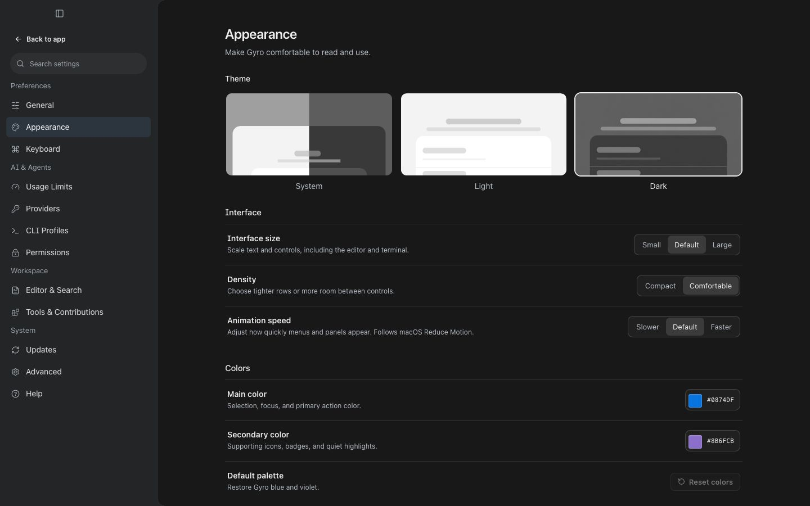
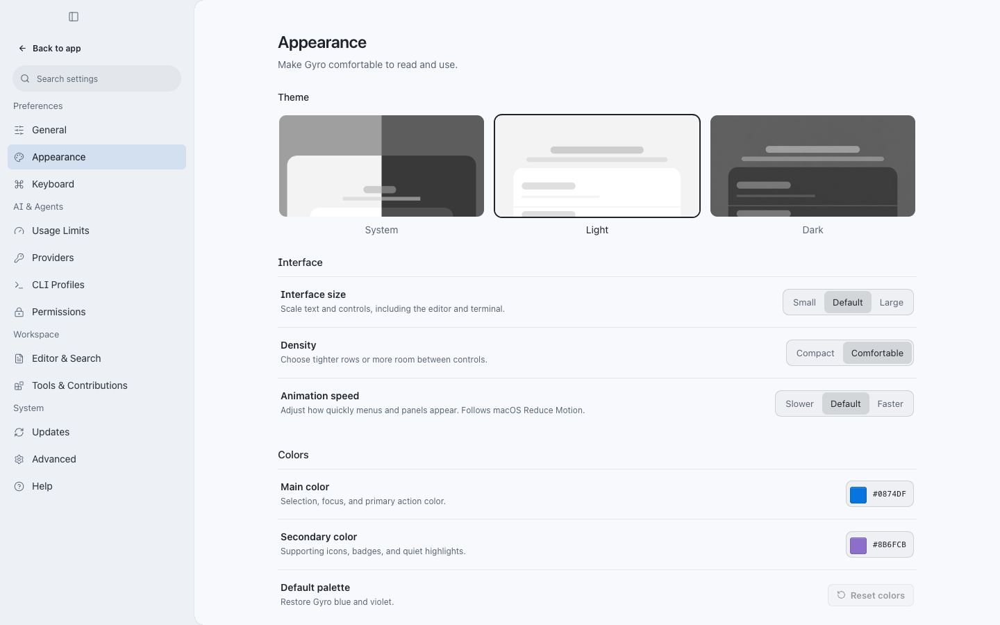

# Appearance upgrade — 27 September 2026

## Implemented

Appearance keeps the existing Settings navigation and theme cards. Its controls are grouped as **Theme**, **Interface**, and **Colors**.

- **Interface size:** Small (90%), Default (100%), Large (115%). Shared text and control sizing also reaches Monaco editors, source-control diffs, and xterm. Resizable pane widths remain user controlled.
- **Density:** existing Compact / Comfortable preference remains independent of size.
- **Animation speed:** Slower (1.5× duration), Default, Faster (0.65× duration). Finite transitions and animations use the shared factor; continuous activity indicators retain their cadence. macOS Reduce Motion overrides visual movement and editor/terminal cursor effects.
- **Colors:** revised graphite dark surfaces and cool light surfaces, clearer muted text and borders, and more readable editor line numbers. Removed later duplicate palette declarations that overrode shared colors.
- Existing custom main/secondary colors remain stored as selected. Displayed accent variants are adjusted for contrast against the shared surfaces; the saved swatch is unchanged. This is targeted contrast protection, not a claim that every UI color combination has passed an accessibility audit.
- Size and speed use the existing workbench preference persistence, default normalization, settings search, and UI reset flow.

## Main implementation files

Paths are relative to the repository root.

| Files | Responsibility |
| --- | --- |
| `packages/ui/src/appearance-settings.tsx`, `settings-controls.tsx`, `surfaces.tsx` | Appearance layout, reusable controls, settings search and callbacks |
| `packages/ui/src/appearance.ts`, `appearance-runtime.ts`, `appearance-context.tsx`, `appearance.css` | Validated choices, contrast derivation, shared runtime values, size/motion rules |
| `packages/ui/src/types.ts`, `workbench-state.ts` | Persisted preferences, normalization, actions, reset defaults |
| `packages/ui/src/styles.css` and component CSS modules | Shared palette, scalable typography/control dimensions, motion durations |
| `apps/desktop/src/use-workbench-appearance.ts`, `App.tsx` | Theme resolution, system preference listeners, root application, context wiring |
| `apps/desktop/src/editor-presentation.ts`, `source-control-diff-editor.tsx`, `live-terminal-pane.tsx` | Monaco/xterm sizing and reduced motion behavior |
| `packages/ui/src/editor/themes/workspace-colors.ts` | Editor popup surfaces and line-number readability |
| `apps/desktop/index.html`, `src/main.tsx`, `src/early-shell.css`, `src/theme.css` | Matching light first-paint color |
| `apps/desktop/src/settings-preview.tsx` | Preview control wiring |
| `scripts/check-workbench-ui.mjs` | Preference, color, sizing, motion, editor and source assertions |

## Verification recorded during implementation

Passed UI and desktop TypeScript checks, workbench UI checks, UI token checks, architecture boundaries, syntax highlighting checks, and whitespace checks. Desktop production build completed in 25.38 seconds; Vite still reports large output chunks.

Browser inspection used the real React application through `capture.html` with fixture data and mocked native IPC:

- At 1440×900, all Appearance groups fit with default size and Comfortable density.
- At 860×620, Large size and Comfortable density produced no document or settings-panel horizontal overflow; descriptions wrapped.
- Size and speed survived a reload through the app's persistence path.
- Reset UI state restored System theme, Default size, Default speed and Comfortable density.
- Settings search found and highlighted Animation speed.
- Small/Slower rendered 12.6px labels and 195ms / 120ms sampled transitions. Large/Faster rendered 16.1px labels and 84.5ms / 52ms sampled transitions.
- The rendered Monaco diff at Large size used 14.95px text and 23px line height on both sides.
- No console errors appeared in the final browser inspection.

Native Tauri behavior, live terminal resizing, the native color picker, and toggling macOS Reduce Motion were not interactively verified. Color contrast and reduced-motion editor options have programmatic checks; those do not replace native interaction coverage.

## Rendered screenshots

These show the actual Appearance component in the browser fixture, not a design mockup.

## Workspace scope

The checkout already contained separate browser/session changes. Those remain in place and are not part of this Appearance report. No commit, push, release, or deployment was performed.
